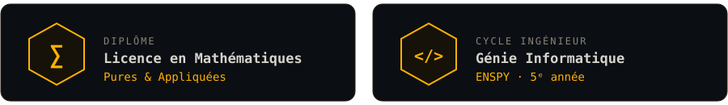

<p align="center">
  
</p>

<p align="center">
  
  
  
  
  
</p>


## [01] INIT — à propos

Étudiant en **5ᵉ année de Génie Informatique à l'ENSPY** (Yaoundé, Cameroun), avec une base solide en **mathématiques pures et appliquées**. J'aime comprendre comment les choses fonctionnent de bout en bout : du capteur qui mesure, au réseau qui transporte, jusqu'à l'application qui affiche.

```json
{
  "nom": "Zenbx",
  "formation": ["Licence Maths Pures & Appliquées", "Génie Informatique @ ENSPY"],
  "terrain_de_jeu": ["systèmes distribués", "devops", "iot & embarqué", "réseaux"],
  "approche": "les maths au service de l'ingénierie",
  "mode": "toujours en train d'apprendre",
  "devise": "Tout le monde est faible, mais c'est l'effort qui crée les forts."
}
```

| Parcours | |
|---|---|
| 🧮 **Licence** | Mathématiques Pures & Appliquées |
| 🎓 **Cycle ingénieur** | Génie Informatique, ENSPY (5ᵉ année) |
| 🧭 **Fil rouge** | Relier le logiciel, le matériel et le réseau |


## [02] FOCUS — ce qui m'occupe

| | Axe | Ce que j'y fais |
|---|---|---|
| 🌐 | **Web & Mobile** | E-commerce Next.js, applications Flutter |
| 🔌 | **IoT / Embarqué** | Suivi de patient, capteurs, microcontrôleurs |
| 🛰️ | **Réseaux** | Communication entre systèmes, protocoles |
| ☁️ | **Distribué & DevOps** | Conteneurs, CI/CD, architectures scalables |
| 🧮 | **Maths appliquées** | Modéliser et optimiser des problèmes d'ingénierie |

**Ce qui m'attire :** les systèmes qui tiennent la charge, les objets connectés qui servent à quelque chose, et le code qu'on peut déployer proprement.


## [03] STACK — mes outils

**Langages**


**Web & Mobile**


**Infra & Outils**


**Embarqué & IoT**


## [04] BUILD — projets phares

| Projet | Description | Techs |
|--------|-------------|-------|
| 🛒 **E-commerce moderne** | Boutique en ligne avec interface soignée | Next.js · Tailwind · Shadcn |
| 🩺 **Suivi de patient** | Collecte et suivi de données de santé via objets connectés | IoT · systèmes embarqués |
| ⚙️ **Gestionnaire de tâches GTK** | Application de bureau avec gestion de threads et progression en temps réel | C · GTK · threads |
| 📊 **Tri & recherche dichotomique** | Implémentation et comparaison d'algorithmes classiques | Java |

> 📂 Tous les détails sont dans mes [dépôts](https://github.com/Zenbx?tab=repositories).


## [05] MONITOR — activité

<p align="center">
  
  
</p>

<p align="center">
  
</p>

<p align="center">
  
</p>

**🐍 Le snake qui mange mes contributions**

<p align="center">
  <picture>
    <source media="(prefers-color-scheme: dark)" srcset="https://raw.githubusercontent.com/Zenbx/Zenbx/output/github-snake-dark.svg" />
    <source media="(prefers-color-scheme: light)" srcset="https://raw.githubusercontent.com/Zenbx/Zenbx/output/github-snake.svg" />
    
  </picture>
</p>


## [06] BADGES — distinctions

<p align="center">
  
</p>

<!--
  TROPHÉES GITHUB : à activer une fois ta propre instance déployée sur Vercel.
  Remplace TON-INSTANCE par l'URL de ton déploiement, puis retire les
  marqueurs de commentaire HTML qui entourent ce bloc.

<p align="center">
  
</p>
-->


## [07] CONNECT — me contacter

<p align="center">
  <a href="mailto:jeffbelekotan@gmail.com"></a>
  <a href="https://github.com/Zenbx"></a>
</p>

> 💫 *« Tout le monde est faible, mais c'est l'effort qui crée les forts. »*

```bash
$ exit 0
# merci d'être passé par là.
```

<p align="center">
  
</p>
